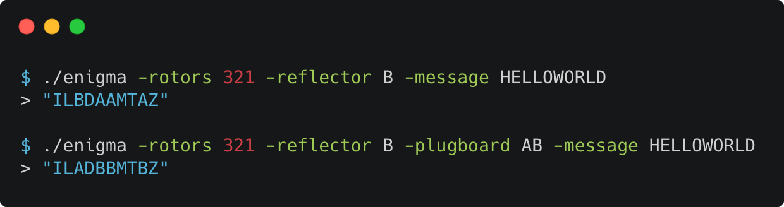

# Enigma Machine in Haskell

_Enigma Machine in Haskell, using QuickCheck and Property-based testing_

Article: [https://eddmann.com/posts/building-an-enigma-machine-in-haskell/](https://eddmann.com/posts/building-an-enigma-machine-in-haskell/)

